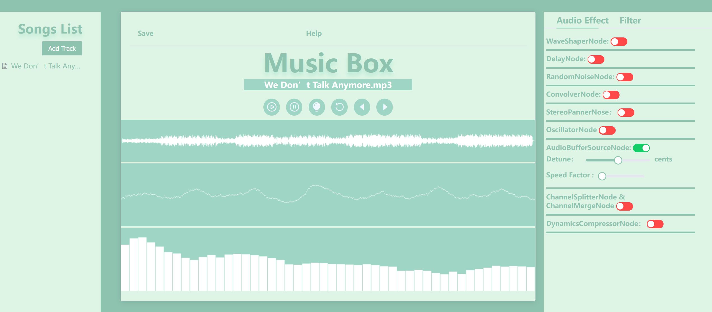
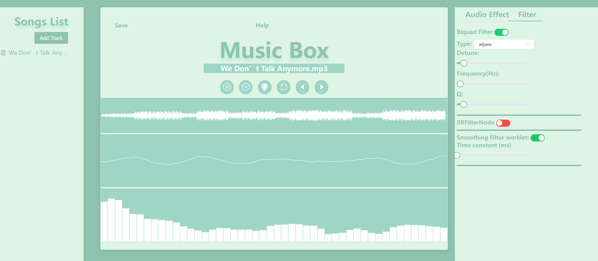

# Advanced Web-Based Audio Player

This is an advanced web-based audio player built using the Web Audio API, HTML, and CSS. It allows users to play audio files, control playback, visualize audio, and apply audio effects and filters.

## Screenshot

## Environment

- Operating System: Windows 10
- IDE: Visual Studio Code
- UI frameworks: Vue2, ElementUI
- Browser: Firefox
- Networking: Internet connection required for online files (e.g., Vue, ElementUI)

## Setup

To run the project:

1. Clone the project repository to your local machine.
2. Open the project folder in Visual Studio Code.
3. Install the necessary dependencies, including Vue2 and ElementUI.
4. Launch the project using Live Server in Visual Studio Code or deploy it to a web server.
5. Access the project via the provided URL, e.g., `http://127.0.0.1:5501/MusicPlayer.html`.

## Features

### Playlist

The left part of the interface contains the playlist. Users can select audio files and click on a file name to play it.

### Music Box

The center part of the interface is the music box. Users can control the playback of the currently selected audio file using the following features:

- Play: Starts or resumes playback.
- Pause: Pauses the current playback.
- Refresh: Stops the current song and starts playing it from the beginning.
- Loop: Enables or disables looping of the current song.
- Previous Song: Plays the previous song in the playlist.
- Next Song: Plays the next song in the playlist.

### Audio Visualization

The music box includes three types of audio visualizations:

- Audio Wave Graph: Displays the waveform of the currently playing audio file.
- Waveform Graph: Visualizes the waveform of the audio file using a graph.
- Frequency Bar Graph: Shows the frequency distribution of the audio using a bar graph.

### Audio Effects and Filters

The right part of the interface allows users to apply various audio effects and filters to the currently playing audio. The following effects and filters are available:

- Dynamics Compressor: Applies dynamic range compression to the audio.
- Wave Shaper: Distorts the waveform of the audio.
- Delay: Adds a delay effect to the audio.
- Random Noise: Introduces random noise to the audio.
- Convolver: Applies convolution reverb to the audio.
- Stereo Panner: Adjusts the stereo panning of the audio.
- Oscillator: Generates an oscillator sound and mixes it with the audio.
- Audio Buffer Source: Allows playback of preloaded audio buffers.

### Biquad Filter

Users can also apply Biquad filters to the audio. Biquad filters are used to modify the frequency response of the audio using various filter types.

## Resources

The following resources were used in the implementation of the audio player:

- [Web Audio API](https://developer.mozilla.org/en-US/docs/Web/API/Web_Audio_API)
- [Vue2](https://v2.vuejs.org/)
- [ElementUI](https://element.eleme.cn/#/en-US)
- [DynamicsCompressorNode](https://developer.mozilla.org/en-US/docs/Web/API/DynamicsCompressorNode)
- [WaveShaperNode](https://developer.mozilla.org/en-US/docs/Web/API/WaveShaperNode)
- [DelayNode](https://developer.mozilla.org/en-US/docs/Web/API/DelayNode)
- [RandomNoiseNode](from the class demo)
- [ConvolverNode](from the class demo)
- [StereoPannerNode](https://developer.mozilla.org/en-US/docs/Web/API/StereoPannerNode/StereoPannerNode)
- [OscillatorNode](from the class demo)
- [AudioBufferSourceNode](https://developer.mozilla.org/en-US/docs/Web/API/AudioBufferSourceNode)
- [BiquadFilterNode](https://developer.mozilla.org/en-US/docs/Web/API/BiquadFilterNode)
- [IIRFilterNode](https://developer.mozilla.org/en-US/docs/Web/API/IIRFilterNode)

This project is a small assignment for a course. Although there might be some issues, it is designed to be helpful to everyone. Your questions and suggestions are highly encouraged, so please feel free to provide feedback.